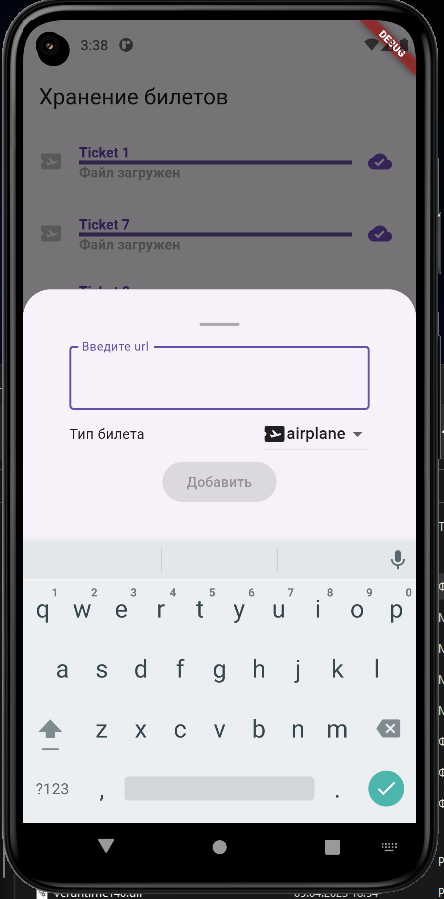

# Результаты работы

## Исполнитель

ФИО - Максим Яковлев

Контакт - http://maxnemoy.t.me

Время выполнения - 7.5ч

Конечно я понимаю что еще есть время, но к сожалению больше не могу времени уделить, я +5 мск у меня уже 23:30, нужно бы ко сну готовится, завтра на работку😎

Спасибо за мероприятия, было очень круто, интересно. Буду следить за обновлениями надеюсь еще увидимся🙌


## Целевая платформа

`Android`

Использовал [flutter_secure_storage](https://pub.dev/packages/flutter_secure_storage), по этому была поднята `minsdk` до 18

>! Используется код-генерация 

Для перестроения используйте

```
flutter pub run build_runner build --delete-conflicting-outputs
```

или [derry](https://pub.dev/packages/derry)

```
derry rebuild
```


## Результаты

### Задание 1 
- [x] Реализуйте интерфейс экрана: Аппбар, состояния экрана, модальное окно (или боттомшит), кнопки, карточку файла.

###  Задание 2
- [x] Реализуйте логику добавления ссылки на загрузку файла. Не забудьте про валидацию данных!

- [x] Реализуйте отображение снекбара при успешном добавлении ссылки.

- [ ] При наличии ссылки формата .pdf в буфере обмена обеспечьте её автоматическую подстановку в поле ввода url.

- [x] Сохранение списка файлов в локальном хранилище.

### Задание 3
- [x] Реализуйте логику отображения списка файлов.

- [x] Добавить скрытие кнопки добавления ссылки, если долистали список до конца.

- [ ] Сортировка файлов по дате добавления, по состоянию загрузки с сохранением в локальной базе данных.

### Задание 4

- [x] Реализуйте процесс загрузки и сохранения файлов. В качестве клиента можно использовать пакет DIO: https://pub.dev/packages/dio

- [x] Удаление файла из хранилища.

- [ ] Загрузка всех незагруженных файлов по одной кнопке.

### Задание 5
- [x] Откройте pdf файл для просмотра на отдельном экране


Так же была задумка реализовать поддержу даты истечения билета и
 скрывать просроченные билеты при фильтрации. Но к сожалению до фильтрации дойти не успел.

Не вышло сделать загрузку по 1 кнопке всех файлов, не совсем удачно спроектировал загрузчик, и понял это только когда решил делать это функцию 🙄

## Ссылки на демонстрацию работы/скриншоты

### Основной экран 


### Добавление данных



### Отображение данных


### Работа приложения


